# Лабораторная работа №1

## Среда

* **ОС:** Windows 11
* **Версия клиента:** 29.8.1
* **Версия сервера:** 29.8.1
* **Базовый образ:** `ngnix:alpine`

## Задания

### 1) Версии и теги

* Определение версии клиента и демона Docker

  ```bash
  docker version
  ```

  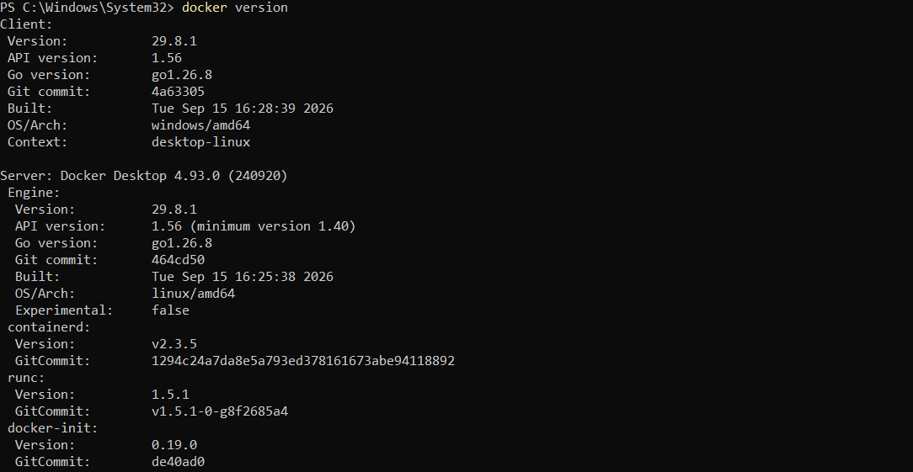

* Выбранный образ в конкретном теге: `nginx:1.31-alpine`
  
  ```bash
  docker run --name select -d nginx:1.31-alpine
  ```
  
  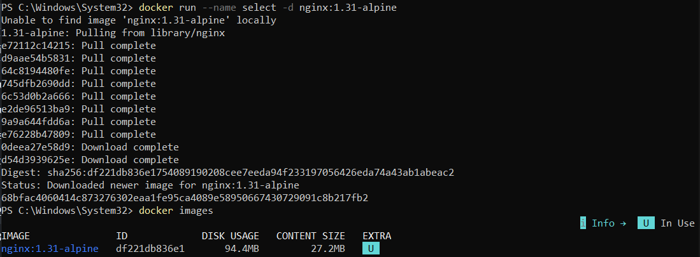

Ссылка на лекцию: [запуск образа с указанием версии (тега)](https://github.com/tiranousor/os-modern-docker-course/blob/main/4-course/docker-and-containers/lectures/03_docker_run.md#6-%D0%B0%D0%B2%D1%82%D0%BE%D0%BC%D0%B0%D1%82%D0%B8%D1%87%D0%B5%D1%81%D0%BA%D0%BE%D0%B5-%D1%83%D0%B4%D0%B0%D0%BB%D0%B5%D0%BD%D0%B8%D0%B5---rm:~:text=%D0%97%D0%B0%D0%BF%D1%83%D1%81%D0%BA%20%D0%BE%D0%B1%D1%80%D0%B0%D0%B7%D0%B0%20%D1%81%20%D1%83%D0%BA%D0%B0%D0%B7%D0%B0%D0%BD%D0%B8%D0%B5%D0%BC%20%D0%B2%D0%B5%D1%80%D1%81%D0%B8%D0%B8%20%28%D1%82%D0%B5%D0%B3%D0%B0)

### 2) Первый запуск сервиса (detached)

* Запуск контейнера в фоновом режиме с именем `lab-web-hearwy` и доступом по `http://localhost:8080`.

  ```bash
  docker run -d --name lab-web-hearwy -p 8080:80 nginx:alpine
  ```
  
  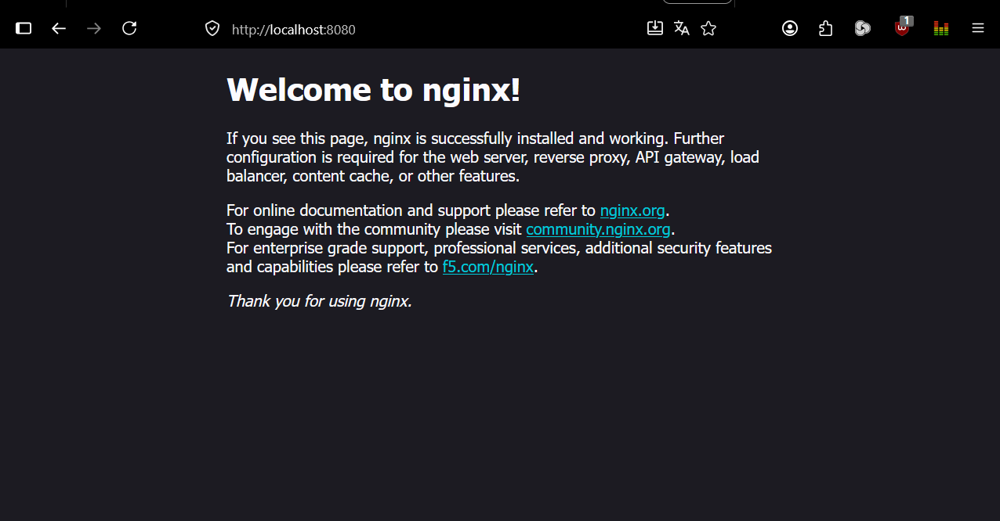

* Перезапуск сервиса.

  ```bash
  #Остановка контейнера
  docker stop lab-web-hearwy

  #Удаление контейнера
  docker rm lab-web-hearwy
  ```

* Перезапуск контейнера на новом порту.

  ```bash
  docker run -d --name lab-web-hearwy -p 9090:80 nginx:alpine
  ```
  
  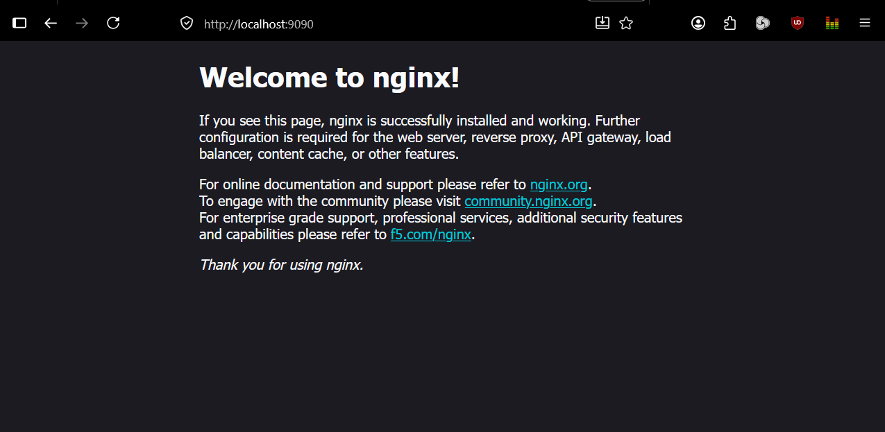

* Список работающих контейнеров

  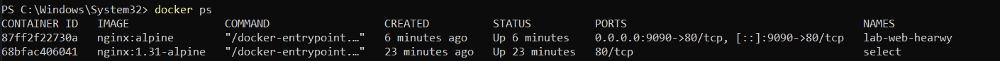

Ссылки на лекции: [проброс портов](https://github.com/tiranousor/os-modern-docker-course/blob/main/4-course/docker-and-containers/lectures/03_docker_run.md#3-%D0%BF%D1%80%D0%BE%D0%B1%D1%80%D0%BE%D1%81-%D0%BF%D0%BE%D1%80%D1%82%D0%BE%D0%B2--p), [именование контейнеров](https://github.com/tiranousor/os-modern-docker-course/blob/main/4-course/docker-and-containers/lectures/03_docker_run.md#4-%D0%B8%D0%BC%D0%B5%D0%BD%D0%BE%D0%B2%D0%B0%D0%BD%D0%B8%D0%B5-%D0%BA%D0%BE%D0%BD%D1%82%D0%B5%D0%B9%D0%BD%D0%B5%D1%80%D0%BE%D0%B2---name)


### 3) Том (bind‑mount): сайт/данные из папки хоста

* Создание папки на хосте с тестовым файлом.

  ```bash
  
  #Создание папки 
  mkdir site

  #Создание тестового файла с подписью
  "Funny" | Set-Content .\site\index.html
  ```

* Перезапуск `lab-web-hearwy`, смонтировав папку как `read‑only`.
  ```bash
  #Остановка контейнера
  docker stop lab-web-hearwy

  #Удаление контейнера
  docker rm lab-web-hearwy

  #Поднимаем nginx и монтируем папку read-only (":ro")
  docker run -d --name lab-web-hearwy -p 8080:80 -v "${PWD}\site:/usr/share/nginx/html:ro" nginx:alpine
  ```

  * Страничка до:
    
    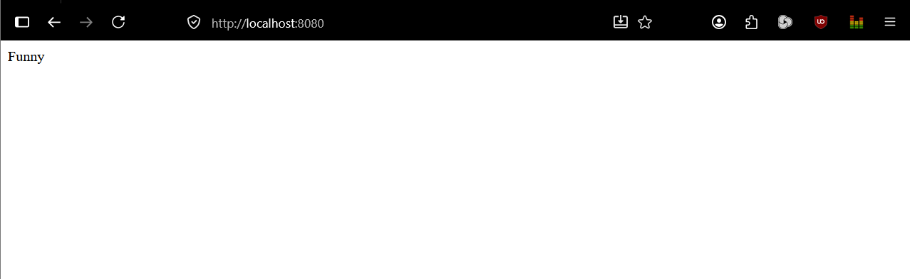
    
* Изменение файла на хосте.

  ```bash
  "Bad" | Set-Content .\site\index.html
  ```
  
  * Страничка после:

    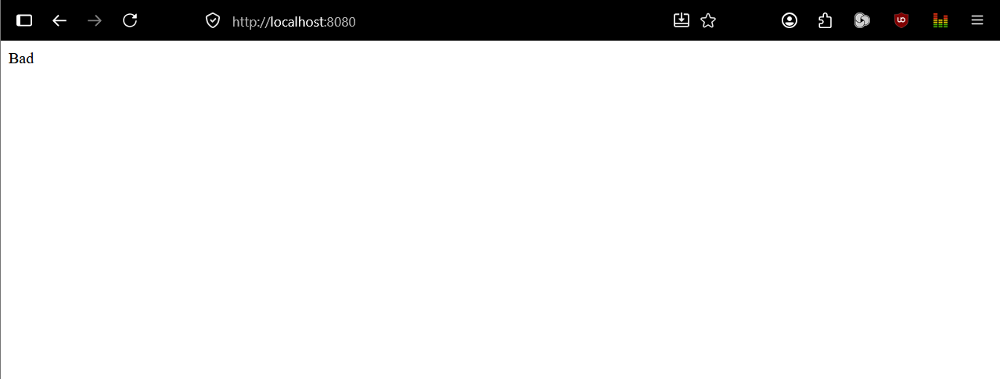

* Почему данные переживут удаление контейнера?

  * Контейнер использует временную файловую систему, которая удаляется вместе с контейнером. С помощью `Bind-mount` идет подключение к контейнеру реального каталога хоста, то есть файлы лежат не внутри контейнера, а на диске хоста. 

Ссылка на лекцию: [монтирование томов](https://github.com/tiranousor/os-modern-docker-course/blob/main/4-course/docker-and-containers/lectures/03_docker_run.md#5-%D1%82%D0%BE%D0%BC-%D0%B4%D0%BB%D1%8F-%D1%85%D1%80%D0%B0%D0%BD%D0%B5%D0%BD%D0%B8%D1%8F-%D0%B4%D0%B0%D0%BD%D0%BD%D1%8B%D1%85--v)


### 4) Интерактив / exec
* Вход внутрь работающего контейнера `lab-web-hearwy` интерактивно.

  ```bash
  docker exec -it lab-web-hearwy /bin/sh
  ```

* Просмотр содержимого каталога со статикой.

  ```bash
  #Переход в папку 
  cd /usr/share/nginx/html

  #Просмотр каталога со статикой
  ls -l 
  ```

  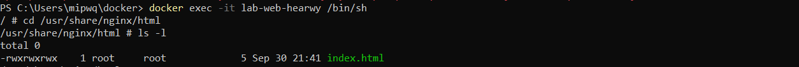

* Попытка создать файл внутри каталога статики при `read-only`.
  
  ```bash
  #Попытка создания тестового файла
  touch test.txt
  ```

  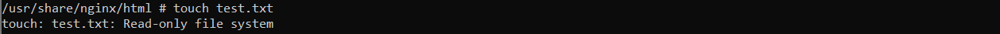

* Перезапуск `lab-web-hearwy` с тем же `bind-mount` без `:ro` (read-write) и повторение создания файла.

  ```bash
  #Остановка контейнера
  docker stop lab-web-hearwy

  #Удаление контейнера
  docker rm lab-web-hearwy

  #Перезапуск lab-web-hearwy с тем же bind-mount без :ro
  docker run -d --name lab-web-hearwy -p 8080:80 -v "${PWD}\site:/usr/share/nginx/html" nginx:alpine

  #Вход в интерактивный режим
  docker exec -it lab-web-hearwy /bin/sh

  #Переход в папку 
  cd /usr/share/nginx/html

  #Создание тестового файла
  touch test.txt
  ```
  
  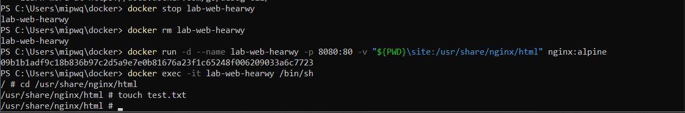

* Проверка файла на хосте после режима `read-word`.

  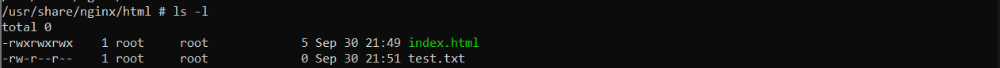

Ссылка на лекцию: [интерактивный режим](https://github.com/tiranousor/os-modern-docker-course/blob/main/4-course/docker-and-containers/lectures/02_commands.md#%D1%88%D0%B0%D0%B3-3-%D0%B2%D1%8B%D0%BF%D0%BE%D0%BB%D0%BD%D0%B5%D0%BD%D0%B8%D0%B5-%D0%BA%D0%BE%D0%BC%D0%B0%D0%BD%D0%B4%D1%8B-%D0%B2-%D1%80%D0%B0%D0%B1%D0%BE%D1%82%D0%B0%D1%8E%D1%89%D0%B5%D0%BC-%D0%BA%D0%BE%D0%BD%D1%82%D0%B5%D0%B9%D0%BD%D0%B5%D1%80%D0%B5-docker-exec)

### 5) Логи и attach

* Генерация HTTP-запросов: обновление страницы через `curl`.
  
  ```bash
  curl http://localhost:8080
  curl http://localhost:8080/nope
  curl http://localhost:8080/nope1
  curl http://localhost:8080/nope2
  ```
  
* Посмотр последних 10 строк журнала контейнера.
  
  ```bash
  docker logs --tail 10 lab-web-hearwy
  ```

  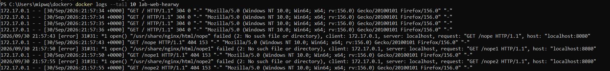

* Прикрепление к основному процессу контейнера, затем корректное отстыкование, не останавливая его.

  ```bash
  docker attach lab-web-hearwy
  ```
  
  * Для выхода из attach, не останавливая контейнер, необходимо нажать `Ctrl + P`, затем `Ctrl + Q`
  * Остановка основного процесса контейнера происходит засчет нажатия `Ctrl + C`

Ссылки на лекции: [получение логов](https://github.com/tiranousor/os-modern-docker-course/blob/main/4-course/docker-and-containers/lectures/03_docker_run.md#8-%D0%BB%D0%BE%D0%B3%D0%B8-%D0%BA%D0%BE%D0%BD%D1%82%D0%B5%D0%B9%D0%BD%D0%B5%D1%80%D0%B0-docker-logs), [docker attach](https://github.com/tiranousor/os-modern-docker-course/blob/main/4-course/docker-and-containers/lectures/02_commands.md#10-docker-attach-%D0%B8--d-%D0%BD%D0%B0-%D0%BF%D1%80%D0%B8%D0%BC%D0%B5%D1%80%D0%B5-%D0%B0%D0%BD%D0%B0%D0%BB%D0%B8%D0%B7%D0%B0-%D1%82%D0%B5%D0%BA%D1%81%D1%82%D0%B0)


### 6) Краткоживущий процесс

* Запуск контейнера, который сразу завершится после выполнения вывода строки.

  ```bash
  docker run --name speedtest alpine echo "Hello!"
  ```

  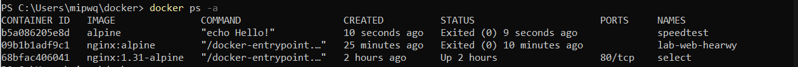

* Почему он завершился сам?

  Контейнер живёт ровно столько, сколько живёт его главный процесс. В контейнере была запущена одноразовая команда `echo`, которая вывела строку и сразу завершилась с кодом 0. 

Ссылка на лекцию: [запуск краткоживущего процесса](https://github.com/tiranousor/os-modern-docker-course/blob/main/4-course/docker-and-containers/lectures/03_docker_run.md#6-%D0%B0%D0%B2%D1%82%D0%BE%D0%BC%D0%B0%D1%82%D0%B8%D1%87%D0%B5%D1%81%D0%BA%D0%BE%D0%B5-%D1%83%D0%B4%D0%B0%D0%BB%D0%B5%D0%BD%D0%B8%D0%B5---rm)

### 7) Inspect

* Получение подробной информации по `lab-web-hearwy`.
  
  ```bash
  docker inspect lab-web-hearwy
  ```

* Вырезка `Ports`:

  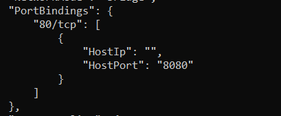
  
* Вырезка `Mounts`:

  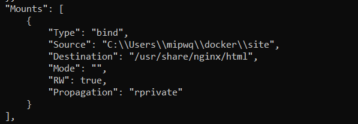

Ссылка на лекцию: [инспекция контейнера](https://github.com/tiranousor/os-modern-docker-course/blob/main/4-course/docker-and-containers/lectures/03_docker_run.md#6-%D0%B0%D0%B2%D1%82%D0%BE%D0%BC%D0%B0%D1%82%D0%B8%D1%87%D0%B5%D1%81%D0%BA%D0%BE%D0%B5-%D1%83%D0%B4%D0%B0%D0%BB%D0%B5%D0%BD%D0%B8%D0%B5---rm)

### 8) Чистка

* Корректная остановка и удаление контейнеров с именами из этой лабораторной работы.

  ```bash
  #Просмотр всех контейнеров
  docker ps -a

  #Удаление всех контейнеров через остановку -f
  docker rm -f speedtest lab-web-hearwy select 
  ```

* Удаление одного из использованных образов.

   ```bash
  #Просмотр всех образов
  docker images

  #Удаление образа 
  docker rmi nginx:1.31-alpine 
  ```

* Итоговый список контейнеров/образов:

  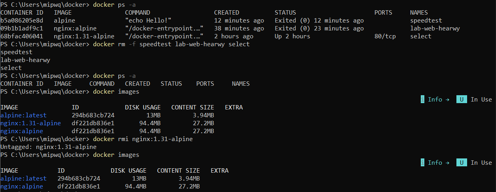

Ссылки на лекции: [удаление контейнеров](https://github.com/tiranousor/os-modern-docker-course/blob/main/4-course/docker-and-containers/lectures/02_commands.md#4-docker-rm), [удаление образов](https://github.com/tiranousor/os-modern-docker-course/blob/main/4-course/docker-and-containers/lectures/02_commands.md#6-docker-rmi)

## Мини‑квиз
### 1. Что произойдёт с данными, созданными **внутри контейнера**, если удалить контейнер без тома?

* Данные удалятся, так как хранятся во временном хранилище, который не сохраняется после завершения работы.

### 2. Чем отличается порт **хоста** от порта **в контейнере**?

* Порт хоста - физический порт на реальной машине, а порт контейнера виртуальный.

### 3. Для чего нужна пара флагов интерактивного запуска, и когда одного из них достаточно?

* Пара флагов необходима для взаимодействия пользователя с терминалом внутри контейнера. `-i` нужен для интерактивного режима(ввода команд внутрь контейнера), а `-t` является псевдотерминалом. Достаточно `-i` для того чтобы передавать команды. контейнеру.

### 4. Что показывает `Mounts` в `inspect` и как понять, что это именно bind‑mount?

* `Mounts` показывает информацию обо всех смонтированных в контейнер пространствах, привязанных директориях хоста и временных файловых системах. Можно понять, что это `bind‑mount` по строчке `"Type": "bind",`.

### 5. Почему образ может не удаляться, и что нужно сделать перед удалением?

* Образ может не удаляться из-за того, что в нем есть существующие контейнеры. Перед удалением образа необходимо удалить все контейнеры, которые используются им.
